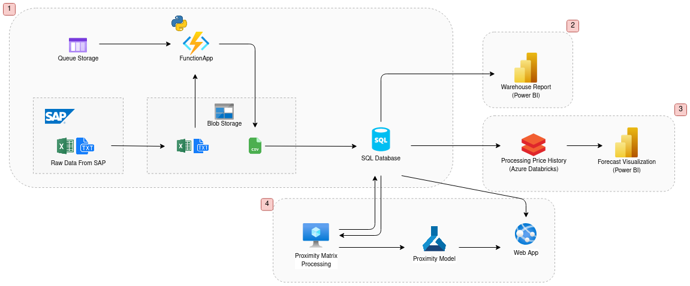

# Supporting Construction Supply Chain with Data Science

> This is a project developed for the Mota-Engil group for the Data Science thesis of Gustavo Fonseca in the Faculty of Sciences of the University of Lisbon.

## Structure


<div align="center">
  
</div>

The pipeline is divided in **four** sections. The first part is the ETL pipeline. We initially load the data inside a Blob Storage, we use the Azure FunctionApp to transform it with a trigger from the Queue Storage, load it back into the Blob Storage in a cleaned up CSV format. With the file properly formatted, we can then BULK INSERT it into the Azure SQL Database, having it ready to be used by multiple applications[1].

Then we have three applications. The first is the development of a Power BI report that accesses the database and makes use of the created views [2]. The second uses Azure Databricks to process the material prices, and use the results to make new visualizations in Power BI[3]. The final application is a Web App that can be used to search for materials and makes use of two types of processing, both of them with an adapted version of the levenshtein distance. The first processing is done with the whole dataset, making use of KNN for clustering, the clusters are then accessible through the database. The second processing is done on-the-go with a levenshtein model deployed in Azure Machine Learning. In this latter case we are able to make requests to an endpoint to obtain the closest materials.[4].

Through this repository it is possible to navigate to all of the sections of this project. This includes:

1. **ConvertData**: repository for the python source code for the transformations done in Azure FunctionApp, it also allows to do transformations locally if python is installed;
2. **Deploy-PL-DB**: repository for the T-SQL source code for the deployment of data into the Azure SQL Database;
3. **Material-Search**: general repository with the jupyter notebook containing the data exploration for material description comparison algorithm and trained clustering models;
4. **Material-Search-Deployment**: Deployment of the code into a VM to make the material clusters and to make the model and endpoint deployment into Azure Machine Learning
5. **Search-App-Code**: The Search-App source code
4. **Material-Price-Forecasting**: repository for azure databricks deployment containing the jupyter notebook with the forecasting of prices.

## Requirements

### Bash
Most of the deployment is being done using Azure CLI for bash. Some commands might need to be changed in order to run in Windows, so for this to be runnable we will consider it a requirement to execute bash scripts.

### Azure CLI
The main method used to communicate with the Azure cloud, to provision and handle the different resources is the [Azure CLI](https://docs.microsoft.com/en-us/cli/azure/install-azure-cli). Since it is intended to save the full deployment in code, and keep a certain level of security, the CLI allows the efficient handling of the different resources.

To startup Azure CLI it is needed to do the login and set the right subscription.
```bash
az login
# It should prompt you to do a login in the browser

# To select the right subscription to use you can select one of the right subscriptions from your list
az account list -o table
az account set --subscription "subscription_1"
```


#### Setting up Credentials
In order to use AZ CLI without having to provide credentials all the time, we provide the login information by running `az login`.

### SQLCMD
[SQLCMD](https://docs.microsoft.com/en-us/sql/tools/sqlcmd-utility?view=sql-server-ver15) is used to communicate with the SQL Server within the Azure SQL Database. We use it to run queries inside the database, allowing to insert data, delete as well as modify its configurations and schemas.

### Azure Functions Core Tools
[Azure Functions Core Tools](https://docs.microsoft.com/en-us/azure/azure-functions/functions-run-local?tabs=linux%2Ccsharp%2Cbash) allows the setting up of the FunctionApp locally and deploying it into the FunctionApp service. 

### Ansible
[Ansible](https://www.ansible.com/) is for deploying applications to a virtual machine using simple YAML configuration files.

## Main Deployment

As a first deployment we upload everything into a Data Lake Storage Account in Azure and process all of the data, finalizing with a deployment into an Azure SQL Database. All of this is done by executing the `deployment.sh` file. We can do this by running the following command:
```bash
bash deployment.sh
```

## Maintenance Deployment

The maintenance deployment is deployed when the whole infrastructure is already provisioned and we just need to add data on top of what already exists.

Many commands have to be rerun due to security reasons, but most are made simpler and faster such as the addition of MB51 and MCBA data.

To run this deployment we should just run the following line of code:
```bash
bash maintenance.sh
```


